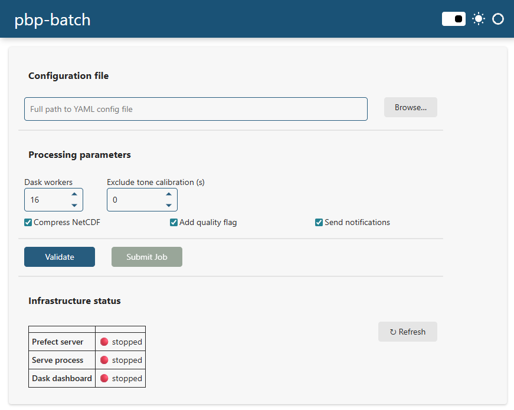

# pbp-batch

Wrapper for the [mbari-pbp](https://github.com/mbari-org/pbp) library for creating metadata files, HMD computation, and daily plots for full acoustic deployments.

Jobs are managed by [Prefect](https://www.prefect.io/) and parallelized across days using [Dask](https://www.dask.org/). Multiple jobs submitted sequentially are queued and processed one at a time. Within each job, each day of data is processed in parallel across Dask workers.

The Prefect server and serve process start automatically in the background on first use and persist across terminal sessions. Jobs can be submitted from the command line or through the browser-based GUI.

---

## Installation

### 1. Install Anaconda

The easiest way to install Python on your machine is to use Anaconda. Follow the instructions on their [website](https://www.anaconda.com/).

### 2. Create a virtual environment

- Open Anaconda Navigator ([instructions](https://docs.anaconda.com/navigator/getting-started/))
- Create a new virtual environment with **Python 3.11** ([instructions](https://docs.anaconda.com/navigator/tutorials/manage-environments/))

### 3. Install pbp-batch

Open a terminal in the virtual environment ([instructions](https://docs.anaconda.com/navigator/getting-started/#navigator-starting-a-terminal)) and run:

```bash
pip install git+https://github.com/xaviermouy/pbp-batch.git
```

To install a specific version:

```bash
pip install git+https://github.com/xaviermouy/pbp-batch.git@v0.0.3
```

---

## Configuration files

Two YAML configuration files are required per deployment:

- **globalAttributes YAML** — deployment-specific information (location, instrument, dates, paths, etc.)
- **variableAttributes YAML** — generic metadata for units and analysis protocol; can be reused across multiple deployments

Example files are provided in the `yaml_templates/` folder of this repository.

pbp-batch validates both files at load time using [Pydantic](https://docs.pydantic.dev/). Any missing fields, wrong types, invalid date ranges, non-existent paths, or out-of-order numeric ranges are reported immediately with a clear error message before any processing starts.

---

## Submitting jobs

### Command line

```bash
pbp-batch submit_job "C:\data\deployment_A.yaml"
```

On first run, pbp-batch automatically starts the Prefect server and serve process in the background. Subsequent calls skip that step and queue immediately.

Submit multiple deployments one after another — they are queued and processed in order:

```bash
pbp-batch submit_job "C:\data\deployment_A.yaml"
pbp-batch submit_job "C:\data\deployment_B.yaml"
pbp-batch submit_job "C:\data\deployment_C.yaml"
```

#### Options

| Argument | Default | Description |
|---|---|---|
| `--dask-workers N` | all CPU cores | Number of parallel Dask workers for per-day HMD processing |
| `--no-compress-netcdf` | compression on | Disable NetCDF compression |
| `--no-quality-flag` | flag on | Disable the quality flag variable in the NetCDF output |
| `--exclude-tone-calibration <seconds>` | `0` | Seconds to exclude from the start of each audio file (e.g. tone calibration signal) |
| `--no-notifications` | notifications on | Disable ntfy.sh phone notifications for this run |

Examples:

```bash
# Use 4 Dask workers
pbp-batch submit_job "C:\data\deployment_A.yaml" --dask-workers 4

# Skip the first 10 seconds of each audio file (tone calibration)
pbp-batch submit_job "C:\data\deployment_A.yaml" --exclude-tone-calibration 10

# Combine options
pbp-batch submit_job "C:\data\deployment_A.yaml" --dask-workers 4 --no-compress-netcdf --exclude-tone-calibration 10
```

### GUI

```bash
pbp-batch gui
```

Opens a browser-based form for submitting jobs. The GUI runs as a background process and the terminal is returned immediately.



Features:
- Browse for the YAML config file (local mode) or type the path (remote/server mode)
- Set all processing parameters via form fields
- **Validate** button runs the full Pydantic check and shows a config summary (date range, paths, recorder) before submission
- Submit is disabled until validation passes; resets automatically when the YAML path changes
- Infrastructure status panel shows live links to the Prefect UI and Dask dashboard

---

## Monitoring

### Quick status

```bash
pbp-batch status
```

Shows which background processes are running, their URLs, and all currently running and queued jobs:

```
Prefect server : running  →  http://127.0.0.1:4200
Serve process  : running
GUI            : running  →  http://localhost:5007
Dask dashboard : stopped  (live during batch processing only)
Notifications  : pbp-runs-xavier-whoi
Flow runs:
  Running   (1):
    - deployment_A
  Scheduled (2):
    - deployment_B
    - deployment_C
```

### Prefect UI

Navigate to [http://127.0.0.1:4200](http://127.0.0.1:4200) or run:

```bash
pbp-batch submit_job
```

The UI shows per-day task status, logs, retries, and the full run history. Failed days can be re-run directly from the UI without re-running successful ones.

### Dask dashboard

Available at [http://localhost:8787](http://localhost:8787) during the batch processing step (per-day HMD generation). Shows active workers, task graph, and memory usage.

### Logs

```bash
# Show last 50 lines of the serve process log
pbp-batch logs

# Show more lines
pbp-batch logs -n 200

# Follow in real time (like tail -f)
pbp-batch logs -f
```

---

## Stopping

```bash
pbp-batch stop
```

Stops the GUI server, serve process, and Prefect server. The next `submit_job` or `gui` call restarts them automatically.

---

## Notifications

pbp-batch can send push notifications to your phone on job completion, failure, or crash using [ntfy.sh](https://ntfy.sh/) — a free, open-source notification service with iOS and Android apps.

### Setup

1. Install the [ntfy app](https://ntfy.sh/) on your phone
2. Subscribe to the default topic `pbp-runs-xavier-whoi` — notifications are enabled out of the box

To use a different topic:

```bash
pbp-batch set-ntfy-topic my-custom-topic
```

The topic is saved to `~/.pbp_batch/ntfy_topic.txt` and applied automatically every time the serve process starts. To disable notifications entirely:

```bash
pbp-batch set-ntfy-topic
```

The current topic is shown in `pbp-batch status`:

```
Notifications  : pbp-runs-xavier-whoi
```

Notifications are sent automatically on:
- ✅ Job completed
- ❌ Job failed
- 💥 Job crashed

Disable notifications for a specific run:

```bash
pbp-batch submit_job "C:\data\deployment_A.yaml" --no-notifications
```

Or uncheck **Send notifications** in the GUI.

---

## How it works

```
pbp-batch submit_job deployment.yaml   (or GUI Submit button)
        │
        └── ensure_infrastructure()  (no-op if already running)
             ├── Prefect server   @ http://127.0.0.1:4200
             └── Serve process    registers deployment + polls for queued runs (limit=1)
        │
        └── queue_run()  → returns immediately

Serve process picks up the run:
  submit_job flow
    ├── load_yaml_file            Pydantic validation + path resolution
    ├── write_globalAttributes    write merged global attributes YAML
    ├── run_pbp_meta_gen          generate per-day JSON metadata files
    ├── run_pbp_hmd_gen_batch     subflow — DaskTaskRunner
    │    ├── day 20230101 ──► Dask worker 1   (retries=4)
    │    ├── day 20230102 ──► Dask worker 2   (retries=4)
    │    ├── day 20230103 ──► Dask worker 3   (retries=4)
    │    └── ...
    ├── run_pbp_main_plot         generate spectrograms (runs after all days)
    └── audit_outputs             verify 1 .nc + 1 .jpg per day; report missing files
```

The serve process runs with `limit=1` so only one job executes at a time — queued jobs wait their turn automatically. Each day-level task retries up to 4 times before being marked as failed. All days are attempted regardless of whether others fail; a summary of failed dates is reported at the end.

---

## Versions

| pbp-batch | mbari-pbp | Python | Notes |
|-----------|-----------|--------|-------|
| v0.0.3    | 1.8.74    | 3.11   | Prefect + Dask; per-day parallelism; job queue; GUI; Pydantic validation; ntfy.sh notifications; output audit |
| v0.0.2    | 1.8.74    | 3.11   | Updated to mbari-pbp 1.8.74 |
| v0.0.1    | 1.6.3     | 3.11   | Initial version |
